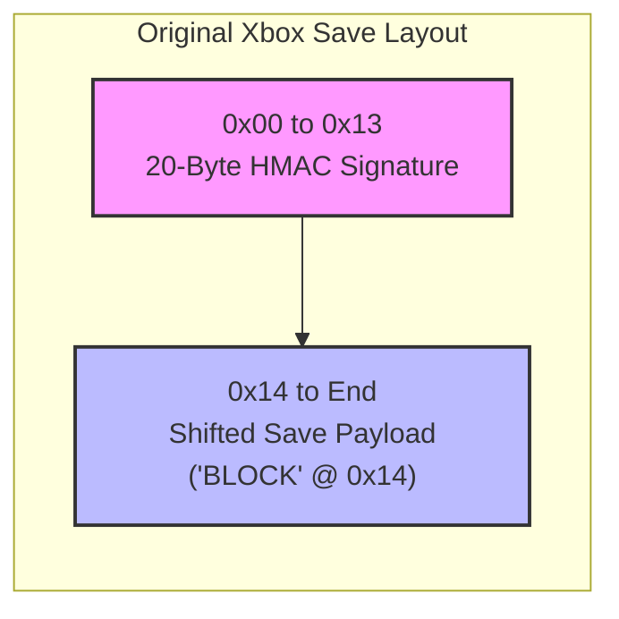

# Reverse Engineering the GTA San Andreas Hot Coffee Save Flag

## Executive Summary
This investigation identified the exact save offsets controlling the censorship flag across PC, PS2, and Original Xbox releases, reconstructed the checksum validation mechanism, and implemented native Xbox HMAC-SHA1 re-signing.
> Throughout this document, "Hot Coffee" refers to the hidden girlfriend minigame (GFSEX).

> **PS2 Version Naming Convention**
>
> The PlayStation 2 release of GTA San Andreas exists in multiple revisions. For clarity, this document uses the simplified naming:
>
> - **PS2 v1** → Original release containing the Hot Coffee content (`1.03` internal version).
> - **PS2 v2** → Later re-release with the Hot Coffee content removed (`3.00` internal version).
>
> A regional **2.01** revision also exists in Europe. However, it belongs to the same censorship-disabled branch as PS2 v2 and is not relevant to this analysis.

---

## Chronological Discovery Timeline

### Phase 1: Structural Analysis & The Checksum Core
Initial research focused on analyzing the basic layout of uncompressed game saves. Using documentation from the **GTA Modding Wiki**, we established that valid saves begin with a mandatory 5-byte magic string: `BLOCK`.

To isolate the censorship parameters, binary diff-testing was conducted on raw save files manipulated by **gothi's legacy GTACensorRemover** utility. The differential testing revealed exactly two modified offset regions:
1. `0x1462`
2. `0x317FC`

> **The Checksum Resolution**
>
> Cross-referencing data with structural specifications confirmed that `0x317FC` is not a flag. Instead, it marks the exact boundary of the trailing **4-byte block checksum** used by the engine to validate file integrity. The game uses a standard 32-bit little-endian additive summation algorithm over the entire save payload. Modifying any value without updating this boundary causes an immediate `Corrupted Save File` crash at runtime.

### Phase 2: The 0x00EE Regional Violence Distraction
During early literature reviews within community forums, offset `0x00EE` was frequently cited as a censorship handler. Deep-dive testing revealed this was an entirely different system altogether:
* **Function:** It controls regional violence parameters (e.g., setting it to `0` disables headshot dismemberment and stops killed pedestrians from dropping money).
* **Behavior:** It is dynamically bound to language configurations. If the active game language is set to English, this flag is automatically forced to `1`. 
* **Conclusion:** This offset has no structural relationship with the girlfriend minigame assets, focusing our research back onto the `0x1462` block.

### Phase 3: Script-Level Variable Mapping
To observe how the game evaluates the raw byte at runtime, we decompiled a custom CLEO-based Hot Coffee enabler authored by **Junior_Djjr**. The script exposed a continuous memory override targeting:
***Global Variable 1219***

Investigating compiler symbol mappings across separate **Sanny Builder** databases exposed a major terminology split:
* **GTA SA (v1.0 - SBL Database):** Defined as `$iCensoredVersion` .
* **GTA SA (PS2 v1.0 Database):** Defined as `$GF_Censore_Flag` .

This demonstrated that both symbolic names resolve to the same global variable `1219`. The game engine handles the flag like this inside `main.scm`:

```scm
// Girlfriend Sex (GFSEX) routine gating
if $GF_Censore_Flag == 1
    return // Explicitly terminates execution, locking uncut sequences
end
```

### Phase 4: Resolving the PC vs. PS2 Layout Split

Up to this stage, the investigation assumed that the retail PC save architecture was an exact mirror of the PS2 structure. However, manual hex injections on PC save files consistently failed to pass engine validation.

By consulting advanced save data templates and global variable tables mapped by researcher OrionSR, a critical cross-platform structural difference was discovered:

- **PS2 v1 (1.03, original release)**: Stores the `$iCensoredVersion` / `$GF_Censore_Flag` state variable at save offset `0x1462`.
- **PC Retail 1.0**: Stores the same censorship state variable 10 bytes earlier, at offset `0x1452`.

This offset discrepancy explains why direct PS2-based patching attempts failed on PC saves. Correcting the alignment allowed the patching utility to achieve native compatibility between the PC and PS2 v1 save formats.

#### Bypassing Original Xbox Dashboard Security: The 20-Byte Header

Porting the tool to the Original Xbox platform exposed another structural anomaly: the `BLOCK` magic string was pushed forward by exactly 20 bytes, shifting the target censorship flag to offset `0x148E`.

This displacement occurs because the Xbox Dashboard kernel encapsulates all game saves with an uncompressed 20-byte cryptographic signature block at the absolute front of the file stream (`0x00` to `0x13`).

However, the save layout shift was not the only platform-specific difference discovered. Cross-referencing OrionSR's Xbox global variable tables revealed that the Xbox release does not use the same SCM global index as the PC and PS2 versions.

While the PC and PS2 v1 releases map the censorship state to:

`Global Variable 1219`

the Original Xbox release maps the equivalent state variable to:

`Global Variable 1223`

This confirms that the Xbox version contains both a different serialized save layout and a different internal global variable mapping, despite preserving the same censorship control logic.



### Native HMAC-SHA1 Re-signing
The Xbox console enforces strict kernel-level authentication . If a save file is modified without calculating a new signature matching the modified payload, the Xbox Dashboard flags it as corrupt before the game can load.

To bypass this dependency without forcing users to rely on external signing programs like XSavSig, we extracted the hardcoded 16-byte Xbox game signing key hidden within the game's executable (default.xbe) from OrionSR's Xbox Save Template :
```text
E3 45 5E 30 DB 1A ED C5 A5 CC 78 7C DE 5D AA CE
```

Based on the formal HMAC specification, we implemented a standalone cryptographic execution pipeline entirely in pure Lua (`crypto.lua`):

$$
\mathrm{HMAC}(K,M)=
\mathrm{SHA1}((K' \oplus opad)\parallel
\mathrm{SHA1}((K' \oplus ipad)\parallel M))
$$

Where:
- $K$ is the 16-byte Xbox authentication key.
- $M$ is the save payload data being authenticated.
- $ipad$ and $opad$ are the standard inner and outer padding constants.

The tool automatically handles both the internal 32-bit checksum update and the 20-byte Xbox signature regeneration.

### Cross-Platform Offset Mapping
The complete reverse-engineered pipeline across all three target platforms is consolidated below:
| Platform | Target Offset | Structural Properties | Script-Level Binding | Effect When Set |
| :--- | :--- | :--- | :--- | :--- |
| **PC 1.0** | `0x1452` | Absolute PC Native | Global Variable 1219 | Restricts Hot Coffee Assets |
| **PS2 v1 (1.03)** | `0x1462` | Absolute PS2 Native | Global Variable 1219 | Restricts Hot Coffee Assets |
| **Xbox v1** | `0x148E` | Shifted (+20 Bytes) | Global Variable 1223 | Restricts Hot Coffee Assets |


### Conclusion

The investigation demonstrates that the Hot Coffee censorship state is represented by a single global script variable whose serialized location differs across PC, PS2, and Original Xbox save formats. In addition to identifying the corresponding offsets, this work reconstructs the checksum and Xbox HMAC validation pipeline  required for valid save modification on all supported platforms.

### Sources & Acknowledgements
- gothi — Discovery of the raw 0x1462 data boundary via legacy patching tools. ([Tool](https://gtaforums.com/topic/196417-hot-coffee-for-ps2/))
- GTA Modding Wiki — Core definitions of the uncompressed `BLOCK` layout structures and checksum definitions. ([Website](https://gtamods.com/wiki/Saves_(GTA_SA)))
- Junior_Djjr — CLEO script structures identifying memory pools mapping to `$GF_Censore_Flag`. ([Mod](https://www.mixmods.com.br/2019/03/mod-cleo-hot-coffee-18/))
- OrionSR — Comprehensive global variable tables, PC save hex mappings, Xbox `GF_Censore_Flag` variable number, and Xbox kernel signature key registers. ([010 Templates](https://gtaforums.com/topic/893779-san-andreas-save-file-companion/)) & ([Global Variables](https://gtaforums.com/topic/984028-gtasa-global-variable-table-with-official-variable-names/))
- Wikipedia — Formal mathematical reference guidelines for the implementation of the HMAC-SHA1 hashing loop. ([Article](https://en.wikipedia.org/wiki/HMAC))
